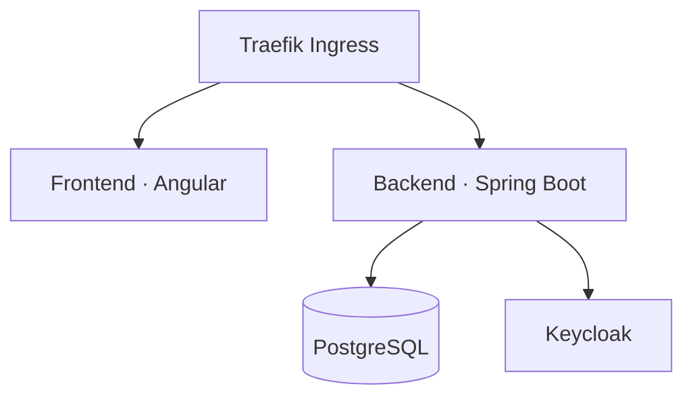
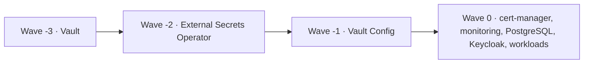
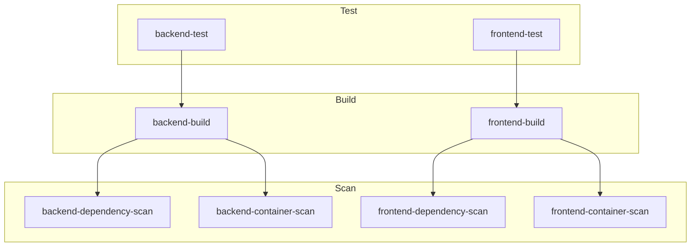
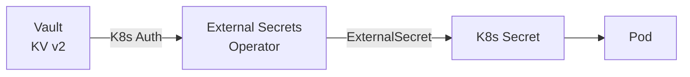

# Notes — Cloud-Native Reference Architecture

A full-stack notes application built as a production-grade Kubernetes platform, demonstrating GitOps, observability, secrets management, and DevSecOps practices.

## Architecture



## Tech Stack

| Layer         | Technology                          | Version  |
|---------------|-------------------------------------|----------|
| Frontend      | Angular, Node                       | 22       |
| Backend       | Spring Boot, Java                   | 4.0.2, 21 |
| Database      | PostgreSQL + Liquibase              | 17       |
| Auth          | Keycloak (OAuth2 / JWT)             |          |
| Observability | Prometheus, Grafana, Tempo, Loki, Alloy |      |
| Secrets       | HashiCorp Vault + External Secrets Operator |  |
| GitOps        | ArgoCD + Image Updater              |          |
| CI/CD         | GitLab CI                           |          |
| IaC           | Helm, Ansible                       |          |
| TLS           | cert-manager + Let's Encrypt        | 1.17.2   |
| Container     | Docker (non-root)                   |          |

## Repository Structure

```
├── backend/        Spring Boot API (Gradle, JPA, OAuth2, Actuator, OTel)
├── frontend/       Angular SPA
├── helm/
│   ├── backend/    Backend Helm chart (Deployment, Ingress, ExternalSecret, ServiceMonitor)
│   └── frontend/   Frontend Helm chart
├── argocd/         App-of-apps manifests (16 applications)
├── k8s/            Plain K8s manifests (cluster-issuer, monitoring, vault-config)
├── ansible/        Node provisioning (sysctl tuning for K8s)
└── .gitlab-ci.yml  Pipeline: test → build → scan
```

## GitOps — ArgoCD

### App-of-Apps Pattern

A single root application (`app-of-apps.yaml`) manages all 16 child applications declaratively. Adding infrastructure is a one-file commit.

### Sync-Wave Ordering

Dependencies boot in order via `argocd.argoproj.io/sync-wave` annotations:



### Auto-Deploy

ArgoCD Image Updater watches the GitLab container registry and updates backend/frontend digests automatically — no pipeline-to-cluster credentials needed.

## CI/CD — GitLab CI



- **Test**: Gradle + PostgreSQL service container; Angular via Node 22
- **Build**: Multi-stage Docker builds, pushed to GitLab registry
- **Scan**: Trivy filesystem + image scans; fails on CRITICAL severity

ArgoCD Image Updater detects new images and syncs to the cluster — the pipeline never touches `kubectl`.

## Observability

| Signal  | Collection              | Storage    | Visualization |
|---------|-------------------------|------------|---------------|
| Metrics | Prometheus + ServiceMonitor | Prometheus | Grafana   |
| Traces  | OpenTelemetry SDK → OTLP    | Tempo      | Grafana   |
| Logs    | Alloy DaemonSet             | Loki       | Grafana   |

- Backend exposes `/api/actuator/prometheus` via `micrometer-registry-prometheus`
- Spring Boot `spring-boot-starter-opentelemetry` sends traces to Tempo
- Grafana datasources (Prometheus, Loki, Tempo) are auto-provisioned via Helm values

## Secrets Management



- **Vault** stores secrets in KV v2, authenticated via Kubernetes ServiceAccount tokens
- **External Secrets Operator** syncs Vault paths to native K8s Secrets
- Workloads reference standard K8s Secrets — zero application changes required
- Least-privilege Vault policy scoped per secret path
- Sync-wave ordering ensures Vault + ESO are ready before any workload deploys

## Security

- **DevSecOps**: Trivy scans dependencies and container images in CI; blocks on CRITICAL findings
- **Auth**: Keycloak issues JWTs; backend validates as OAuth2 resource server
- **Secrets**: Vault-managed, never stored in Git
- **Containers**: Non-root processes
- **TLS**: cert-manager provisions Let's Encrypt certificates automatically
